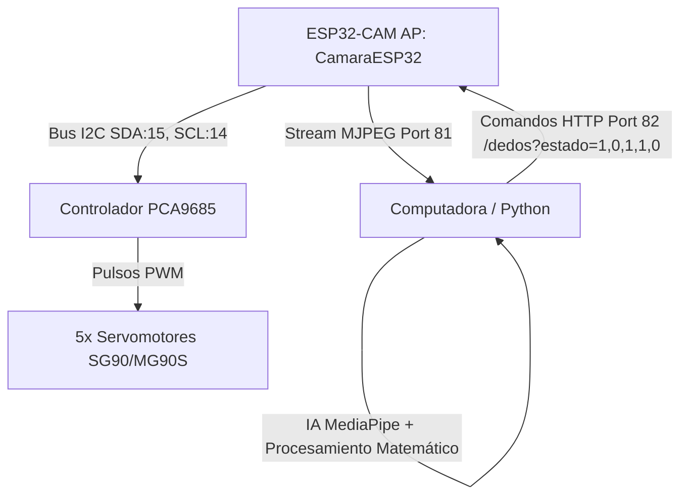

# Mano Robótica Controlada por Gestos via WiFi (ESP32-CAM + MediaPipe)

Este proyecto implementa un sistema de teleoperación inalámbrica de alta velocidad para una mano robótica de 5 dedos. El sistema utiliza **Visión Artificial** en tiempo real para detectar la mano de un usuario mediante la cámara de un **ESP32-CAM** por WiFi, procesa los movimientos con **MediaPipe** en la computadora (PC) y envía los comandos de movimiento a los servomotores a través de un controlador **PCA9685** conectado por I2C al ESP32.

El microcontrolador está programado de forma nativa en **C** usando el framework oficial **ESP-IDF (Espressif IoT Development Framework)** con soporte de sistema operativo en tiempo real (**FreeRTOS**), logrando una velocidad, estabilidad y eficiencia muy superiores a las implementaciones tradicionales en Arduino.

---

## 🚀 Arquitectura del Sistema



### Características Principales:
* **Transmisión Ultra Rápida y sin Lag**: Python utiliza un hilo de comunicación persistente con una cola de envío optimizada de tamaño 1. Esto garantiza que la PC siempre envíe el estado más reciente, eliminando por completo los retrasos acumulados en la red WiFi.
* **Filtro de Histéresis contra Temblores**: El script de Python incorpora un algoritmo con memoria para calcular el estado abierto/cerrado de los dedos mediante distancias euclidianas. Evita los temblores molestos de los servos cuando el usuario tiene la mano a medio cerrar.
* **Sistema de Pausa y Salida Segura**: 
  * Presionando la **Barra Espaciadora** en la PC se pausa el seguimiento y la mano robótica se abre completamente por seguridad.
  * Presionando **'q'** se cierra el programa y se envía un comando forzado para abrir la mano robótica por completo, previniendo que los motores queden atascados haciendo fuerza.

---

## 🛠️ Requisitos de Hardware

1. **ESP32-CAM** (Modelo estándar AI-Thinker).
2. **Controlador PCA9685** (Módulo de 16 canales PWM por I2C).
3. **5 Servomotores** (SG90 o MG90S).
4. **Fuente de Alimentación Externa de 5V (Mínimo 2A o 3A)** para alimentar los servomotores (el ESP32-CAM no puede suministrar suficiente corriente para los motores).
5. **GND común**: Es crítico unir el GND de la fuente externa de 5V con el GND del ESP32-CAM y del PCA9685.
6. **Programador FTDI / USB a TTL** para subir el código al ESP32-CAM.

---

## 🔌 Diagrama de Conexiones

Asegúrate de realizar las conexiones de la siguiente manera:

| Desde (ESP32-CAM) | Hacia (PCA9685) | Notas |
| :--- | :--- | :--- |
| **GPIO 15** | **SDA** | Bus I2C (Datos) |
| **GPIO 14** | **SCL** | Bus I2C (Reloj) |
| **5V / 3.3V** | **VCC** | Alimentación del chip lógico del PCA9685 |
| **GND** | **GND** | Tierra común de la lógica |

| Desde (Fuente de 5V Externa) | Hacia (PCA9685 - Bloque de Bornes) | Notas |
| :--- | :--- | :--- |
| **V+ / 5V** | **V+ (Borne Verde)** | Alimentación de potencia para Servos |
| **GND** | **GND (Borne Verde)** | Tierra de potencia. **Unir con el GND de la ESP32-CAM** |

### Servomotores en el PCA9685:
* **Canal 0**: Pulgar
* **Canal 1**: Índice
* **Canal 2**: Medio
* **Canal 3**: Anular
* **Canal 4**: Meñique

---

## 💻 Configuración y Flasheo del ESP32-CAM (ESP-IDF)

El proyecto incluye la carpeta `espressif/` configurada como un proyecto nativo de ESP-IDF.

### Opción 1: Usando la Extensión de VS Code (Recomendado)
1. Instala la extensión **Espressif IDF** en VS Code.
2. Configura la extensión (`Ctrl+Shift+P` -> `ESP-IDF: Configure ESP-IDF Extension` -> selecciona **Express**).
3. Abre la carpeta `espressif/` en VS Code.
4. Conecta tu ESP32-CAM en modo de flasheo (GPIO 0 a GND antes de encender) mediante el programador USB-TTL.
5. Selecciona el puerto COM correspondiente y la placa `ESP32` en la barra inferior.
6. Presiona el botón de **Build** 🔨 (Compilar) y luego **Flash** ⚡ (Subir código).
7. Desconecta el GPIO 0 de GND y reinicia el módulo.

### Opción 2: Usando la Consola de ESP-IDF
Abre tu consola de ESP-IDF (con el entorno exportado) y ejecuta:
```bash
# Entrar a la carpeta
cd espressif

# Compilar el proyecto
idf.py build

# Subir al ESP32 (reemplaza COM4 por tu puerto)
idf.py -p COM4 flash

# Monitorear logs en tiempo real
idf.py -p COM4 monitor
```

*Nota: El archivo `sdkconfig` ya se encuentra preconfigurado y optimizado con soporte para PSRAM y la correcta velocidad del procesador para la cámara del ESP32.*

---

## 🐍 Ejecución de la Aplicación en la PC (Python)

### 1. Preparar el entorno virtual
En la raíz del proyecto, abre una terminal y crea un entorno virtual:
```bash
# Crear entorno
python -m venv .venv

# Activar en Windows (PowerShell)
.venv\Scripts\Activate.ps1

# Activar en Linux/macOS
source .venv/bin/activate
```

### 2. Instalar dependencias
Instala las librerías necesarias ejecutando:
```bash
pip install -r requirements.txt
```

### 3. Ejecutar el controlador
Conéctate con tu computadora a la red WiFi que genera el ESP32-CAM:
* **SSID**: `CamaraESP32`
* **Contraseña**: `12345678`

Una vez conectado, ejecuta el script principal:
```bash
python mano_robotica_wifi_camara.py
```

*Nota: La primera vez que inicies el script, este **descargará automáticamente** el modelo ligero de MediaPipe (`hand_landmarker.task`) de los servidores oficiales de Google y lo guardará localmente en el directorio de trabajo, por lo que no requieres realizar descargas manuales.*

---

## 🎮 Controles en Pantalla
* **Barra Espaciadora**: Pausa / Reanuda el envío de movimientos. Por seguridad, al pausar el sistema, la mano robótica se abrirá por completo.
* **Tecla 'q'**: Cierra de forma segura la ventana, envía un comando final de apertura a la mano y finaliza el script.
